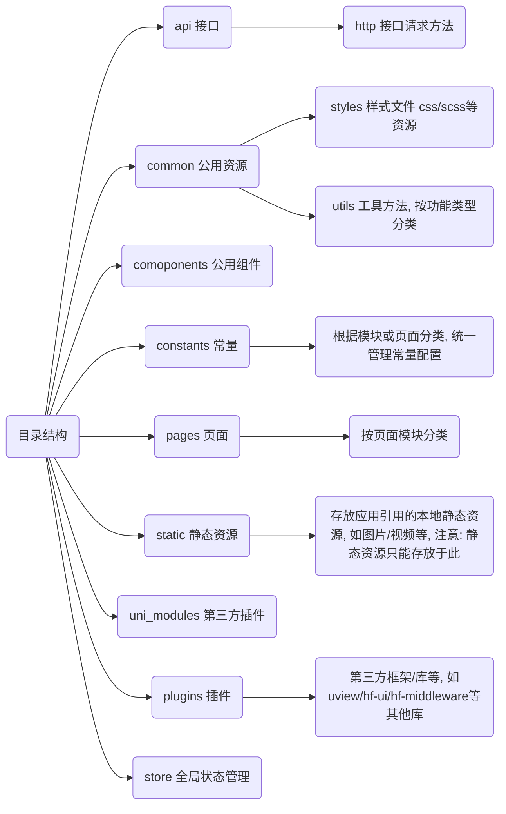

> 参考
>
> vue官方文档：[vue2 风格指南](https://v2.cn.vuejs.org/v2/style-guide)
>
> uniapp官方文档：[uni-app](https://uniapp.dcloud.net.cn/)
>
> 前端代码规范：[前端代码规范 --代码规范篇 - 掘金](https://juejin.cn/post/7217305951551602743)
>


**规范**

目的：编写高质量的代码，提高代码质量和可读性，增强团队协作开发效率，统一编码风格规范

文档说明：本文旨在统一团队前端代码规范，参考vue、百度等前端规范，结合团队日常业务需求以及团队日常开发过程中的总结而制定，如果发现错误敬请指正~

# 组件规范

组件条件：

- 如果相同逻辑代码，重复两次，可以考虑拎出组件
- 如果只是某个模块特有，放`pages/对应模块文件夹/components`下
- 如果是公共组件，放`根目录/components`下


组件命名规范：

- 单文件组件文件名，命名规范全局一致

   - 组件文件名为`kebab-case`（短横线连接）格式
   - 栗子：`todo-list.vue`

- 用特定样式、前缀约定基础组件

   - 栗子：`hf-form-select`、`hf-form-input`

- 单例组件名，以`The`前缀命名，以示其唯一性

- 和父组件紧密耦合的子组件，以父组件名作为前缀命名

  ``` lua
  |components
     |-- todo-list.vue
     |-- todo-list-item.vue
     |-- todo-list-item-button.vue
  ```

- 组件名中的单词顺序：以高级别的单词开头，以描述性的修饰词结尾。
   编辑器通常会按字母顺序组织文件，所以组件之间的重要关系一目了然

   ``` lua
   |components
   |-- SearchButtonClear.vue
   |-- SearchButtonRun.vue
   |-- SearchInputExcludeGlob.vue
   |-- SearchInputQuery.vue
   |-- SettingsCheckboxLaunchOnStartup.vue
   |-- SettingsCheckboxTerms.vue
   ```


## 组件开发规范

* 每个组件单独分成文件

* 易被修改

* 功能简单但完整

* 有示例和文档 示例应该包括一个最简单的用法和最复杂的用法

* 稳定

  - 添加新参数或者逻辑，尽量做到向下兼容，不能因为组件版本升级而导致原先已使用该组件的代码出错
  - 栗子：新添加的props，默认值为原先逻辑

* 跨端

  * 跨端，不是把web的习惯迁移到全平台。而是按照uni的写法，然后全平台使用
  * 保证不同环境的兼容：编辑完成，需要运行到各环境（H5、微信小程序、APP），查看是否有兼容性问题，是否需要调整
  
  > 参考：[uniapp官网 - 跨端注意](https://uniapp.dcloud.net.cn/matter.html)
  
* 单文件组件的顶级元素顺序

  ``` html
  <template>...</template>
  <script>/* ... */</script>
  <style>/* ... */</style>
  ```

* 模板中只包含简单的表达式，复杂的表达式重构为计算属性或方法
   把复杂的计算属性分割为尽可能多的更简单的计算属性

   ``` html
   <template>
   	<div v-show="limitData">...</div>
   </template>
   <script>
   export default {
   	computed: {
   		limitData() {
   			return data.type !== 'dir' && dzqz && hasBtn && attrs.mode !== 'ended';
   		}
   	}
   }
   </script>
   ```
   
* 避免使用隐性的父子组件通信
   应该优先通过 prop 和事件进行父子组件之间的通信，而不是`this.$parent`或变更 prop

* 优先使用vuex管理全局状态，而不是通过全局事件总线

## uniapp组件使用

项目里组件使用的3种逻辑

1. 常规：`import`导入，`components`注册，模板代码里使用`<xx-xx></xx-xx>`
2. 从插件市场导入的组件，可以直接在模板代码里使用，例如：`<u-button></u-button>`
   1. 在`uni_modules`目录下，可以鼠标右键 - 【浏览插件市场详情页】查看插件详情
   2. uniapp会自动扫描符合`components/组件名称/组件名称.vue`目录结构的组件，不用手动导入，可直接使用
3. 自动匹配的组件：可以直接在模板代码里使用，例如：`<hf-form-input></hf-form-input>`
   1. 文件`pages.json`配置`easycom`

> 官方文档：[easycom](https://uniapp.dcloud.net.cn/collocation/pages.html#easycom)

# HTML规范

## 用法规范

1. 统一使用双引号
   
1. 代码嵌套
   根据元素嵌套规范，每个块状元素独立一行，内联元素可选，如下：

   ```html
   <view>
     <scroll-view></scroll-view>
     <view></view>
   </view>
   <view><text></text><text></text></view>
   ```

## vue规范

1. 在`template`模板中使用组件，
   规范：`kebab-case`（短横线连接）
   
   ``` html
   <my-component></my-component>
   ```
   
2. 在`template`模板中使用attribute
   
   - 规范：`kebab-case`（短横线连接）
   - 非空 HTML attribute 值始终带引号（双引号）
   
   ``` html
   <my-component greeting-text="hi"></my-component>
   <my-component :style="{ width: sidebarWidth + 'px' }"/></my-component>
   ```
   
3. 多特性分行写
    提高可读性，组件应用时换行，每个attribute一行

    顺序：
    
    - 列表渲染：`v-for`
    - 条件渲染：`v-if`、`v-else-if`、`v-else`、`v-show`
    - 全局感知：`id`
    - 唯一的attribute：`ref`、`key`
    - class
    - 双向绑定：`v-model`
    - 其他attribute
    - 事件：v-on

    ``` html
    <test-component
        ref="testComponent"
        class="test-component"
        :data="testData"
        :pullDownRefresh="true"
        :pullUpLoad="true"
        @click="handleClick"
    ></test-component>
    ```
   
4. `v-for`设置键值`key`
   在组件上用`key`配合`v-for`，以便维护内部组件及其子树的状态。

5. 避免把`v-if`和`v-for`同时用在同一个元素上
   两种常见情况的修改方法：

   - 为了过滤一个列表中的项目：`v-for="user in users" v-if="user.isActive"`，可以将users替换为一个计算属性，让其返回过滤后的列表。
   - 为了避免渲染本应该被隐藏的列表：`v-for="user in users" v-if="shouldShowUsers"`，可以将`v-if`移动到容器元素上（外层元素）

   vue2：`v-for`优先级高于`v-if`
   vue3：`v-if`优先级高于`v-for`

6. 指令缩写
   
    - v-bind缩写：`:`
    - v-on缩写：`@`
    - v-slot缩写：`#`
   
7. 如果一组`v-if` + `v-else`的元素相同，可以使用`key`避免vue直接复用元素（比如两个`<div>`元素）

8. 活用`v-show`，`v-if`

    - v-show不会改变dom树，不会导致重排
    - v-if会改变dom树，会导致重排

# CSS规范

> uni-app官网：[uni.scss](https://uniapp.dcloud.net.cn/collocation/uni-scss.html)

* 预处理语言：`scss`
  
  * 原因：根目录下`uni.scss`文件，`uni-app`的编译器在`webpack`配置中特殊处理了这个文件，使得每个scss文件都被注入了这个文件，代码中无需手动`import`导入，全局可用文件中的变量。

* 全局变量写在根目录下`uni.scss`文件

## 用法规范

### 避免

* 避免使用标签选择器
  因为在 Vue 中，特别是在局部组件，使用标签选择器效率特别低，损耗性能，建议需要的情况，直接定义 class
* 非特殊情况下，禁止使用 ID 选择器定义样式。有 js 逻辑的情况除外
* 避免使用important选择器
* 避免大量的嵌套规则，控制在3级之内，对于超过4级的嵌套，考虑重写或新建子项
* 避免使用ID选择器及全局标签选择器防止污染全局样式
* 避免使用前缀，不考虑浏览器兼容的语法，只是css代码，后处理器自动补齐代码

### 推荐使用

1. 提取公用样式进assets文件styles里，按模块/功能区分

   ``` lua
   |assets
   |-- styles
   |   |-- common          放置公用样式，如重置，混合，复写element样式等
   |   |-- modules         放置模块样式
   ```

2. 推荐使用直接子选择器

   ``` scs
   /* 推荐 */
   .jdc {}
   .jdc li {}
   .jdc li p {}
   
   /* 不推荐 */
   * {}
   #jdc {}
   .jdc div {}
   ```

3. 非特殊情况，`style`标签使用`scoped`关键字，约束样式生效的范围，防止全局同名`css`污染

   * 为组件样式设置作用域，使用`scoped`关键字
     顶级`App`组件和布局组件中的样式可以是全局的，其他所有组件都应该是有作用域的。
     
      ```html
      <style lang="scss" scoped>
        .app-wrapper {
            ...
        }
      </style>
      ```

4. 使用变量

   ``` scss
   // CSS
   .class-name {
       color: red;
       border-color: red;
   }
   
   // SCSS
   $color: red;
   .class-name {
       color: $color;
       border-color: $color;
   }
   ```

5. 使用混合（mixin）
    根据功能定义模块，然后在需要使用的地方通过 @include 调用，避免编码时重复输入代码段
    
    ``` scss
    // CSS
    .jdc_1 {
        -webkit-border-radius: 5px;
        border-radius: 5px;
    }
    .jdc_2 {
        -webkit-border-radius: 10px;
        border-radius: 10px;
    }
    
    // SCSS
    @mixin radius($radius:5px) { // 当前代码可写入公用样式库mixin文件中
        -webkit-border-radius: $radius;
        border-radius: $radius;
    }
    .jdc_1 {
        @include radius; // 参数使用默认值
    }
    .jdc_2 {
        @include radius(10px);
    }
    ```

6. 每个选择器及属性独占一行

   ``` scss
   // 推荐
   button {
       width: 100px;
       height: 50px;
       color: #fff;
       background: #00a0e9;
   }
   
   // 不推荐
   button {
   	width:100px;height:50px;color:#fff;background:#00a0e9;
   }
   ```

7. 省略0后面的单位

   ``` scss
   // 推荐
   div {
     padding-bottom: 0;
     margin: 0;
   }
   
   // 不推荐
   div {
     padding-bottom: 0px;
     margin: 0em;
   }
   ```


## 书写顺序

CSS 属性书写顺序：先决定定位宽高显示大小，再做局部细节修饰，推荐顺序：

定位属性(或显示属性，display) -> 宽高属性 -> 边距属性(margin, padding) -> 字体，背景，颜色等，修饰属性的定义，这样定义为了更好的可读性，让别人只要看一眼就能在脑海中浮现最终显示的效果。

1. 布局定位属性：display / position / float / clear / visibility / overflow
2. 自身属性：width / height / margin / padding / border / background
3. 文本属性：color / font / text-decoration / text-align / vertical-align / white- space / break-word
4. 其他属性（CSS3）：content / cursor / border-radius / box-shadow / text-shadow / background:linear-gradient …

以下给出常用的定义示例：

```css
.class-name {
    position: fixed;
    top: 100px;
    left: 0;
    right: 0;
    bottom: 0;
    display: block;
    width: 100%;
    height: 100%;
    margin: 10px;
    padding: 10px;
    font-size: 14px;
    color: #000;
    background-color: red;
    border-radius: 2px;
    line-height: 1.42;
}
```

## 样式覆盖

组件内部需要覆盖UI框架样式，必须在最外层组件加类名，如下：

```html
<template>
  <div class="input-area-container">
    <el-input class="name-input"></el-input>
  </div>
</template>

<style lang="scss">
.input-area-container {
  .name-input {
    .el-input__inner {
      font-size: 16px;
    }
  }
}
</style>
```

## 注释规范

以/ 注释内容 /格式注释，前后空格，嵌套子类需要一个回车分割开

```scss
/* 注释内容 */
.pha-element {
    width: 20px;
                /* 这里需要换行 */
    .pha-element-l {
      color: blue
    }
}
```

# JavaScript规范

## 用法规范

1. 统一使用单引号

2. 坚持单一原则，函数内仅做该函数应该做的，尽量避免通过传入标记控制不同行为

3. 优先考虑三目运算符，但谨记不要写超过3层的三目运算符

4. 对于无用代码必须及时删除，例如：一些调试的 console 语句、无用的弃用功能代码，如在开发分支可提交打印代码，但要注意打印格式，如下：

   ```js
   // 推荐
   console.log('路由': 文件路由, '打印简述': 打印数据);
   
   // 不推荐
   console.log(打印数据, '1111');
   ```

5. 请求数据的方法，使用try catch 错误捕捉，注意执行回调

   ```js
   /**
    * 接口请求
    * @param req 接口api
    * @param params 参数
    */
   async httpInterface(req, params) {
       try {
           this.loading = true;
           const res = await req(params);
           return Promise.resolve(res);
       } catch (e) {
           return Promise.reject(e);
       } finally {
           this.loading = false;
       }
   }
   
   // 使用
   this.httpInterface(req, {}).then((resove, reject) => {
       console.log(resove, reject);
   })
   ```

## vue规范

1. 组件的data必须是一个返回对象的函数（除`new vue`外的任何地方）
   原因：当data的值是一个对象时，它会在这个组件的所有实例之间共享
   
2. 组件名

   - 多个单词，且命名规范为`PascalCase`（大驼峰）格式
     避免跟现有的以及未来的 HTML 元素相冲突，因为所有的 HTML 元素名称都是单个单词的
   - 使用完整单词，而不是缩写
   - 栗子：`name: 'TodoList'`

3. props
   定义应该尽量详细，至少需要指定其类型

   - 命名：`camelCase`（小驼峰）
   - 注释：解释说明
   - 加上`required`或`default`
   - 如果有业务需要，加上`validator`验证

   ``` js
   props: {
   	// 组件状态, 用于控制组件的颜色
   	componentStatus: {
   		type: String,
   		required: true,
   		validator(value) {
   			return ['success', 'info', 'error'].includes(value);
   		}
   	}
   }
   ```

4. 组件的选项顺序
   
   ``` js
   export default {
   	name: 'ExampleName',			// 命名规范: PascalCase 大驼峰
   	// 模板内使用的资源
   	components: {},					// 组件
   	directives: {},					// 指令
   	filters: {},					// 过滤器
   	// 混入
   	mixins: [],						// 混入
   	props: {},						// props 定义
   	data() {						// data 定义
   		return {
   			dataProps: ''
   		}
   	},
   	computed: {},					// 计算属性
   	watch: {},						// 属性变化监听器
   	// uniapp生命周期钩子函数
   	onLoad() {},
   	onShow() {},
   	// 生命周期钩子函数
   	created() {},
   	mounted() {},
   	// 非响应式的property
   	methods: {						// 组件方法
   		publicbFunction() {}		// 公共方法的定义，可以提供外面使用
   		_privateFunction() {}		// 私有方法，下划线定义，仅供组件内使用。多单词，注意与系统名字冲突
   	}
   }
   ```
   
5. 私有property名
   语义化英文命名，仅组件内部不允许外部访问的函数，使用`$_`前缀，并附带一个命名空间以回避和其他作者的冲突
   栗子：`$_myGreatMixin_update() {...}`

## 注释规范

函数注释：写明传入参数名称，类型，推荐完整注释以下格式

```js
/**
 * @Description 加入购物车
 * @Author lint 
 * @Date 2020-09-08 
 * @param {Number} goodId 商品id
 * @param {Array<Number>} specs sku规格
 * @param {Number} amount 数量
 * @param {String} remarks 备注
 * @returns <Promise> 购物车信息
 */
apiProductAddCard = (goodId, specs, amount, remarks) => {
   return axios.post('***', {
       goodId,
       specs,
       amount,
       remarks
   })
}

/**
 * @Description 根据字典编码获取选项名称
 * @Author lint
 * @Date 2020-09-08
 * @param {String} key 编码
 * @param {String} val 值
 * @returns {String} 字典名称
 */
getDictText(key, val) {
   const item = this.dictData[key].find(k => k.dictKey === val)
   return item ? item.dictValue : ''
}
```

# 命名规范

## 图片命名

图片使用img，图标使用icon

* `img_功能/类型_编号`
* `icon_功能/类型_编号`

## 文件命名

1. 按照小驼峰命令，英文单词过长或超出2个以上，可缩略至前四位，如
   
   1. 业务统计：approvalStatistical
   2. 缩略：approvalStat

2. 有复数含义，采用复数命名，如：pages, componets, filters, mixins ，images

3. 存放 images, styles, icons 等静态资源，静态资源命名格式为小写+中划线，如
   
   ```lua
   |assets
   |-- icons
   |   |-- icon-label-red.png
   |-- images
   |   |-- img_background-color.png
   |   |-- img_company-logo.png
   |-- styles
   ```

## 方法命名

***method*** 方法命名不同于文件命名，尽量完整英文命名，语义表达需完整清楚

method 方法必须是 **动词**，或者 **动词 + 名词** 形式

1. 按照小驼峰命名法，可使用常见动词约定
   
   * `can` 判断是否可执行某个动作，函数返回一个布尔值。true：可执行；false：不可执行
   * `has` 判断是否含有某个值， 函数返回一个布尔值。- true：含有此值；false：不含有此值
   * `is`： 判断是否为某个值，函数返回一个布尔值。true：为某个值；false：不为某个值
   * `get`： 获取某个之，函数返回一个非布尔值
   * `set`： 设置某个值，无返回值、返回是否设置成功或者返回链式对象 load 加载某些数据,无返回值或者返回是否加载完成的结果

3. 引入组件：首字母大写的驼峰法命名。推荐使用 ES6 的方式引入
   
   ```js
   import Article from 'xxx';
   import ArticleDetail from 'xxx';
   ```

4. 变量：使用驼峰式命名，优先使用`let`、`const`、避免使用`var`
   
   ```js
   let userName = 'luffy'
   const userInfo = {
     name: 'luffy'
   }
   ```

5. 常量：字母全部大写，以下横线`_`划分
   
   ```js
   const ITEMS_OFONE_TYPE = '***'; // 获取事项分类
   const SOLUTION_LIST = '***'; // 获取事项列表
   ```

## 样式命名

class命名以小写字母开头，小写字母、中划线和数字组成。

不建议使用驼峰法命名 class 的属性。

以下是一些常用到的 class的名字：

* 包裹层：.xx-wrap
* 列表：.xx-list
* 列表项：.xx-list-item
* 左边内容：.xx-left
* 中间内容：.xx-middle
* 右边内容：.xx-right
* 某个页面：.xx-page

## 常用词

1. 常用动词
   
   | 简写                | 说明      |
   | ------------------- | --------- |
   | get/set             | 取值/赋值 |
   | add/remove          | 增加/删除 |
   | show/hide           | 显示/隐藏 |
   | view/browse         | 查看/浏览 |
   | edit                | 修改      |
   | save/submit         | 保存/提交 |
   | insert/delete       | 插入/移除 |
   | find                | 查询      |
   | index               | 索引      |
   | clean               | 清除      |
   | expand/collapse     | 展开/折叠 |
   | observe/listen      | 观察/监听 |
   | send/receive        | 发送/接收 |
   | refresh/synchronize | 刷新/同步 |
   | create/destroy      | 创建/移除 |
   | start/stop          | 启动/停止 |
   | begin/end           | 开始/结束 |
   | split/merge         | 分割/合并 |
   | bind/separate       | 绑定/分隔 |
   | undo/redo           | 撤销/重做 |
   | encode/decode       | 编码/解码 |
   | encrypt/decrypt     | 加密/解密 |
   
2. 常用缩写
   
   | 数据类型/标签  | 简写   |
   | -------- | ---- |
   | object   | obj  |
   | array    | arr  |
   | json     | json |
   | function | fn   |
   | message  | msg  |
   | button   | btn  |

# 工程结构

## 思维导图



## 目录结构

``` lua
|-- api					所有api接口
|   |-- https				封装的公用请求方法，除非必要不可修改，影响全局
|-- common				公用资源
|   |-- styles				样式文件 css/scss等资源
|   |-- utils				工具方法(按功能类型分类)
|       |-- utlis				公共 JS 工具函数
|       |-- array				数组类工具函数
|       |-- filters				过滤器工具函数
|       |-- ...
|-- components			公用组件
|-- constants			常量
|-- pages				页面(所有业务逻辑的页面)
|-- static				静态资源
|   |-- icons				icons图标
|   |-- images				images图片
|-- uni_modules			插件
|-- plugins				插件, 第三方插件统一导入文件
|-- store				vuex 全局状态管理
|   |-- modules			各模块状态
|-- main.js				Vue初始化入口文件
|-- App.vue				应用配置，用来配置App全局样式以及监听 应用生命周期
|-- manifest.json		配置应用名称、appid、logo、版本等打包信息
|-- pages.json			配置页面路由、导航条、选项卡等页面类信息
|-- uni.scss			uni-app内置的常用样式变量
```

## 文件说明

1. api中的方法名字要与后端api，url尽量保持语义高度一致
2. 提交代码时候要把断点，打印等删除
3. 文件、变量命名尽量与后端保持一致
4. 无特殊情况统一用以下插件/工具/库，如需引用其他库，统一放置plugins文件内，注意按需引入
   - 组件库：uview、hf-ui
   - 预处理器：scss
   - 中间件：hf-middleware
   - 组件
     - 缺省提示：hic-tips

